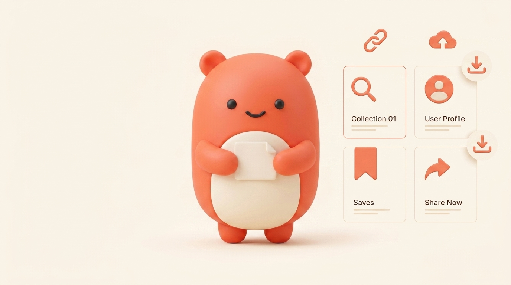

# Linkban (لینکبان)

<p align="center">
  
</p>

<p align="center">
  <strong>Never lose a link you care about.</strong><br>
  A calm, lightweight, and offline-first bookmark and reminder assistant for Android.
</p>

<p align="center">
  <a href="#key-features">Key Features</a> •
  <a href="#why-linkban">Why Linkban?</a> •
  <a href="#onboarding-and-design">Design & Mascot</a> •
  <a href="#support--connect">Support</a> •
  <a href="#technical-architecture">Technical Details</a>
</p>

---

## Overview

We all come across interesting articles, videos, tutorials, and websites every day, but rarely have time to read them immediately. Browser tabs pile up, bookmarks get forgotten, and traditional "read-it-later" apps are often bloated with accounts, social feeds, and intrusive notifications.

**Linkban** is built to solve this problem simply and privately. It acts as a personal queue for your web links, letting you save URLs in a split second, set gentle reminders, or store private links in a biometric-locked vault.

---

## Key Features

### ⚡ Quick Save from Anywhere
- **System Share Menu**: Share any link directly from Chrome, Firefox, Telegram, or any other app.
- **Contextual Text Selection**: Select any URL text in an app and tap **"Save to Linkban"** to save it instantly in the background without interrupting your workflow.
- **Clipboard Detection**: Auto-detects copied links when you open the app.

### ⏰ Smart Reminders & Flexible Bookmarks
- **Customizable Intervals**: Set revisit timers for 30 minutes, 1 hour, 2 hours, 1 day, or custom dates.
- **Save-Only Mode**: Save links purely as bookmarks with no notification noise.
- **Quiet Hours**: Define silent periods so notifications never disturb your sleep or work.

### 🔒 Secret Vault with Biometric Protection
- **Fingerprint & PIN Security**: Lock sensitive or private links behind biometric authentication or a 4-digit PIN.
- **Masked Notifications**: Reminders for secret links hide URLs and titles on the lock screen for complete privacy.
- **Secure Opening**: Tapping a secret reminder opens the app directly into authentication before revealing the link.

### 📊 Reading Stats & History Archive
- **Visit Counter**: Automatically counts how many times you open each link.
- **Visual Insights**: Clean, flat bar charts showcasing your top visited links and favorite domains.
- **Completed Archive**: Mark links as done with confetti celebrations and restore them whenever needed.

### 🌐 Bilingual & Fully Localized
- **Persian & English Support**: Complete translation with natural, modern Persian tone and native RTL layout.
- **Interactive Onboarding**: A friendly 3-step setup guide to choose your language and tour core features.

---

## Why Linkban?

| Feature | Linkban | Traditional Read-Later Apps |
| :--- | :--- | :--- |
| **Account Requirement** | None (Zero login) | Required |
| **Privacy & Storage** | 100% Local on Device | Cloud Servers & Telemetry |
| **Secret Vault** | Built-in (Fingerprint / PIN) | Rare or Paid Tier |
| **Background Text Save** | Native Android Action | Rare |
| **Battery Impact** | Zero (Native Android Alarms) | Frequent background sync |
| **Data Ownership** | One-tap Backup & Restore | Proprietary or Locked |

---

## Onboarding and Design

Linkban embraces a calm, flat pastel design palette with solid accents and strictly zero gradient distractions. Meet our friendly mascot, who guides you through initial setup and greets you across the app:

<p align="center">
  
  
</p>

---

## Support & Connect

Linkban is crafted with care by **Sajjad**.

- ☕ **Buy me a coffee**: [coffeete.ir/sajjadmrx](https://coffeete.ir/sajjadmrx)
- 𝕏 **Twitter / X**: [@sajjadmrx](https://x.com/sajjadmrx)

---

## Technical Architecture

For developers and contributors interested in the underlying stack:

### Stack & Technologies
- **Frontend Framework**: [React 19](https://react.dev/) with [TypeScript](https://www.typescriptlang.org/)
- **Build Tool**: [Vite 6](https://vitejs.dev/) with [Bun](https://bun.sh/) package manager
- **Styling**: [Tailwind CSS v4](https://tailwindcss.com/) + [DaisyUI 5](https://daisyui.com/) (flat solid themes)
- **Icons**: [Lucide React](https://lucide.dev/)
- **Mobile Runtime**: [Capacitor 8](https://capacitorjs.com/) (Android)
- **Local Storage**: `@capacitor/preferences` (Offline key-value store)
- **Native Android Extensions**:
  - `ProcessText` activity for background text selection saving (`QuickSaveProcessTextActivity.java`).
  - Native `LocalNotifications` with custom action categories and secure disguised payloads.
  - Native Biometric / Fingerprint authentication integration.

### Development Setup

```bash
# 1. Clone the repository
git clone https://github.com/your-username/linkban.git
cd linkban

# 2. Install dependencies
bun install

# 3. Start local development server
bun run dev

# 4. Build web production bundle
bun run build

# 5. Sync web assets with Capacitor Android
bunx cap sync android

# 6. Open in Android Studio or build APK directly
bunx cap open android
# or
cd android && ./gradlew assembleDebug
```

---

## License

Distributed under the MIT License. See `LICENSE` for more information.
